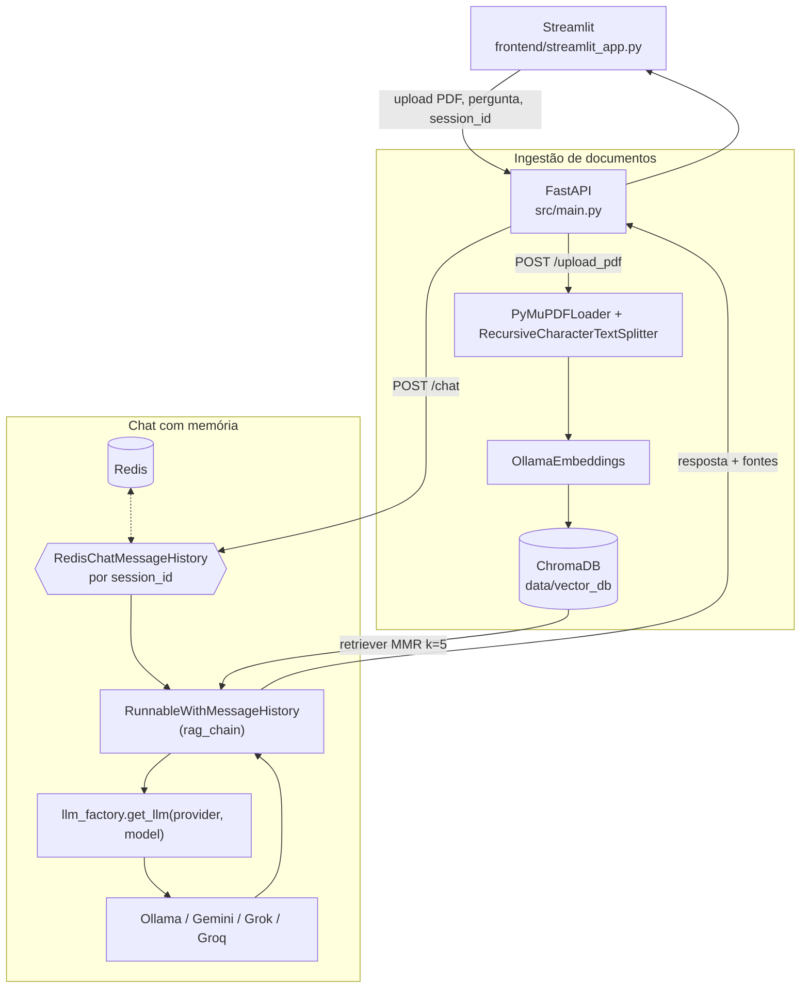

# PRJ-02 — Memory RAG

Segundo projeto de uma progressão de 8 técnicas de RAG (PRJ-01 a PRJ-08, orquestradas por um 9º projeto de deploy): evolui o Vanilla RAG (PRJ-01) adicionando memória de conversação persistente por sessão.

## Visão geral

O PRJ-01 respondia cada pergunta isoladamente: sem histórico, sem contexto entre mensagens. Isso quebra qualquer conversa real, porque perguntas de acompanhamento ("e sobre isso, o que mais diz o documento?") dependem do que foi perguntado antes.

O PRJ-02 resolve isso guardando o histórico de cada conversa no Redis, indexado por `session_id`. A cada pergunta, a chain do LangChain recupera o histórico da sessão, injeta como contexto de conversa e só então busca os trechos relevantes no ChromaDB — a memória de curto prazo (o que já foi dito) e a memória de longo prazo (o conteúdo do PDF) operam em conjunto, mas com papéis diferentes: o histórico ajuda a entender a pergunta, o documento continua sendo a única fonte da resposta.

Nesta fase do projeto também foi adicionado suporte multi-provider de LLM: a geração de texto pode rodar em Ollama (local, sem custo), Google Gemini, xAI Grok ou Groq Cloud, escolhido por requisição. Os embeddings continuam fixos no Ollama — trocar o modelo de embedding invalidaria o banco vetorial já indexado.

## Funcionalidades

- Upload de PDF com extração, chunking e indexação vetorial (`POST /upload_pdf`).
- Chat com memória de conversação persistente por `session_id`, armazenada no Redis (`POST /chat`).
- Listagem e remoção de documentos indexados (`GET /list_docs`, `DELETE /remove_doc`).
- Reset completo da base vetorial e dos uploads (`POST /clear_db`).
- Seleção de motor de LLM por requisição — `provider` e `model` opcionais no corpo do chat, com fallback para o padrão do `.env`.
- Diagnóstico de providers com dois níveis: configuração (chave e SDK presentes) e verificação (uma chamada real respondeu) — `GET /providers`.
- Cache de motores por combinação `(provider, model)`: trocar de motor na interface não descarta o motor anterior nem remonta a chain a cada pergunta.
- Interface Streamlit com upload, listagem/remoção de documentos, chat com fontes citadas e seletor de motor de LLM que testa cada provider ao carregar a tela e só oferece os que respondem.

## Arquitetura



O Redis guarda apenas o histórico de mensagens da sessão (perguntas e respostas anteriores), não os vetores do documento. A cada chamada em `/chat`, `RunnableWithMessageHistory` busca esse histórico pelo `session_id`, injeta como `MessagesPlaceholder` no prompt, e a chain segue para o retriever do ChromaDB e depois para o LLM escolhido.

## Stack tecnológica

| Componente | Tecnologia | Papel |
|---|---|---|
| Backend | FastAPI + Uvicorn | API REST (`src/main.py`) |
| Frontend | Streamlit | Interface de chat e upload (`frontend/streamlit_app.py`) |
| Orquestração de chain | LangChain (`langchain-core`, `langchain-community`) | Prompt, retriever, memória conversacional |
| Banco vetorial | ChromaDB | Armazena embeddings dos chunks do PDF |
| Memória de conversa | Redis (`RedisChatMessageHistory`) | Histórico de mensagens por `session_id` |
| Embeddings | Ollama (`nomic-embed-text` por padrão) | Fixo — trocar invalidaria o índice vetorial |
| LLM de geração | Ollama, Google Gemini, xAI Grok, Groq Cloud | Escolhido por provider via `llm_factory.py` |
| Extração de PDF | PyMuPDF (`fitz`) | Leitura e split de texto do documento |
| Configuração | python-dotenv | Variáveis de ambiente (`.env`) |

## Suporte multi-provider de LLM

`src/core/llm_factory.py` é o único ponto do projeto que conhece as classes concretas de chat model. O resto do código (`rag_engine.py`, `main.py`) pede um LLM e recebe um `BaseChatModel` pronto, sem saber se é Ollama, Gemini, Grok ou Groq.

**Providers suportados:**

| Provider | Custo | Variável de chave | Modelo padrão |
|---|---|---|---|
| `ollama` | Zero — local | (nenhuma) | `llama3.2:3b` |
| `gemini` | Pago (free tier limitado) | `GEMINI_API_KEY` ou `GOOGLE_API_KEY` | `gemini-2.5-flash` |
| `grok` | Pago | `XAI_API_KEY` | `grok-4-latest` |
| `groq` | Pago (free tier limitado) | `GROQ_API_KEY` | `llama-3.3-70b-versatile` |

**Como trocar de motor:**
- Via `.env`: `LLM_PROVIDER=gemini` define o padrão para todas as chamadas sem `provider` explícito.
- Via requisição: o corpo de `POST /chat` aceita `provider` e `model` opcionais — o motor é resolvido e cacheado por essa combinação, sem afetar o motor padrão.
- Via interface: o seletor lateral testa todos os providers configurados ao carregar a tela e só oferece os que responderam de fato.

**Diagnóstico "configurado vs verificado":** `GET /providers` devolve, para cada provider, dois estados independentes:
- `available` — a configuração está completa (SDK instalado, chave presente no `.env`). Não prova que o provider funciona.
- `verified` — uma chamada real foi feita: `true` respondeu, `false` falhou, `null`/ausente nunca foi testada.

Ter chave e SDK não garante resposta: a conta pode estar sem crédito, a chave pode ter sido revogada, o modelo pode ter sido descontinuado. `GET /providers?probe=true` força uma chamada mínima (`"Responda apenas com a palavra: OK"`) a cada provider configurado e classifica qualquer falha numa categoria acionável (`sem_credito`, `chave_invalida`, `limite_taxa`, `modelo_inexistente`, `rede`, `desconhecido`), distinguindo essas falhas de uma falha de infraestrutura (Redis ou ChromaDB fora do ar), que não deve ser atribuída ao provider de LLM.

Os SDKs de Gemini, Grok e Groq são importados sob demanda dentro de `llm_factory.py` — um provider não instalado não derruba os outros nem a inicialização do projeto. Eles não vêm fixados em `requirements.txt`; para usá-los, instale o pacote indicado na mensagem de erro (`langchain-google-genai`, `langchain-xai` ou `langchain-groq<1.0`).

## Estrutura de pastas

```
PRJ-02_Memory_RAG/
├── README.md
├── requirements.txt
├── docker-compose.standalone.yml     # Redis isolado, porta 6381
├── debug_chroma.py                   # inspeção manual do ChromaDB
├── frontend/
│   ├── streamlit_app.py              # interface de chat e upload
│   └── seletor_llm.py                # seletor de motor de LLM (testa providers)
├── src/
│   ├── main.py                       # FastAPI: rotas da API
│   ├── api/
│   │   ├── __init__.py
│   │   └── schemas.py                # QueryRequest, QueryResponse, HealthResponse
│   └── core/
│       ├── __init__.py
│       ├── rag_engine.py             # RagEngine: chain RAG + memória via Redis
│       └── llm_factory.py            # fábrica multi-provider de LLM
├── scripts/
│   ├── verify_env.py                 # checa dependências instaladas
│   └── test_memory_api.py            # smoke test manual contra a API real
└── tests/
    ├── test_rag.py
    ├── test_llm_factory.py
    └── test_provider_health.py
```

## Como rodar

### Local — standalone (sem o PRJ-09)

1. Ambiente virtual e dependências:
   ```bash
   python3 -m venv venv
   source venv/bin/activate
   pip install -r requirements.txt
   ```

2. Suba o Redis isolado (porta 6381 — a 6380 é reservada ao Redis compartilhado do PRJ-09):
   ```bash
   docker compose -f docker-compose.standalone.yml up -d
   ```

3. Configure o `.env` (veja as chaves usadas em `src/core/llm_factory.py` e `src/core/rag_engine.py`):
   ```env
   OLLAMA_HOST=http://localhost:11434
   MODEL_NAME=llama3
   EMBEDDING_MODEL_NAME=nomic-embed-text
   REDIS_URL=redis://localhost:6381
   LLM_PROVIDER=ollama
   # Opcionais, só necessários para os providers pagos:
   GEMINI_API_KEY=
   XAI_API_KEY=
   GROQ_API_KEY=
   ```

4. Com o Ollama em execução, suba a API:
   ```bash
   uvicorn src.main:app --reload --port 8000
   ```

5. Em outro terminal, suba a interface:
   ```bash
   streamlit run frontend/streamlit_app.py
   ```

### Via Docker / PRJ-09 (orquestrado)

O PRJ-09 é o orquestrador do ecossistema: sobe o Redis compartilhado na porta 6380 (usado por PRJ-02 e PRJ-03) e um container de API e um de UI para cada projeto RAG. A partir da pasta do PRJ-09:

```bash
docker compose up -d
```

Isso publica a API do PRJ-02 em `localhost:8002` e a interface em `localhost:8502`, com `REDIS_URL` já apontado para o Redis do compose (`redis://redis:6379`) e `API_URL` da UI apontado para o container da API (`http://prj-02-api:8000`) — por isso o frontend lê `API_URL` de variável de ambiente em vez de um valor fixo.

## Referência da API

| Método | Rota | Descrição |
|---|---|---|
| `GET` | `/` | Mensagem de boas-vindas |
| `GET` | `/health` | Status da engine (LLM e ChromaDB) |
| `GET` | `/providers` | Diagnóstico dos motores de LLM. `?probe=true` faz uma chamada real a cada um |
| `POST` | `/upload_pdf` | Upload de PDF; extrai, faz chunking e indexa no ChromaDB |
| `POST` | `/chat` | Pergunta + `session_id` (+ `provider`/`model` opcionais); resposta com fontes |
| `GET` | `/list_docs` | Lista os documentos indexados |
| `DELETE` | `/remove_doc?filename=` | Remove um documento do índice e do disco |
| `POST` | `/clear_db` | Apaga toda a base vetorial e os uploads |

## Testes

```bash
pytest tests/ -q
```

54 testes passando, cobrindo resolução de provider/modelo, a fábrica de LLM (`llm_factory.py`), a classificação de falhas de providers (`test_provider_health.py`) e a chain do RAG com dependências pesadas (LangChain, gRPC, PyMuPDF) mockadas via `sys.modules` para manter a suíte rápida e hermética.

`scripts/test_memory_api.py` é um smoke test manual à parte, que bate na API real (não faz parte da suíte automatizada).

## Limitações conhecidas / decisões de engenharia

- **Sessão de memória sem expiração automática configurada no código.** `RedisChatMessageHistory` persiste o histórico indefinidamente por `session_id`; não há TTL definido no projeto — cabe a quem opera o Redis definir uma política de expiração se necessário.
- **`session_id` é responsabilidade do cliente.** A API confia no valor recebido; não há autenticação nem isolamento entre usuários além do próprio identificador de sessão.
- **SDKs de providers pagos não estão em `requirements.txt`.** Ficam fora do pin do projeto de propósito — cada um só é importado se o provider correspondente for usado, e o erro de import já indica o comando de instalação.
- **`/providers?probe=true` gasta uma chamada real (e crédito) por provider configurado.** Está sem retry deliberadamente (`max_retries=0`), para não travar a tela no backoff de um 429; em compensação, um probe repetido pode contar contra o limite de requisições de free tier.
- **Fontes citadas vêm de uma segunda consulta ao retriever, fora da chain de memória.** `query()` roda a chain conversacional e, separadamente, invoca o retriever de novo só para montar a lista de fontes — funciona porque o retriever é determinístico, mas significa duas buscas vetoriais por pergunta.
- **Retenção da chave `OPENAI_API_KEY` no `.env`** é herdada do PRJ-01 mas não é usada por nenhum provider deste projeto — nenhum builder em `llm_factory.py` a referencia.
